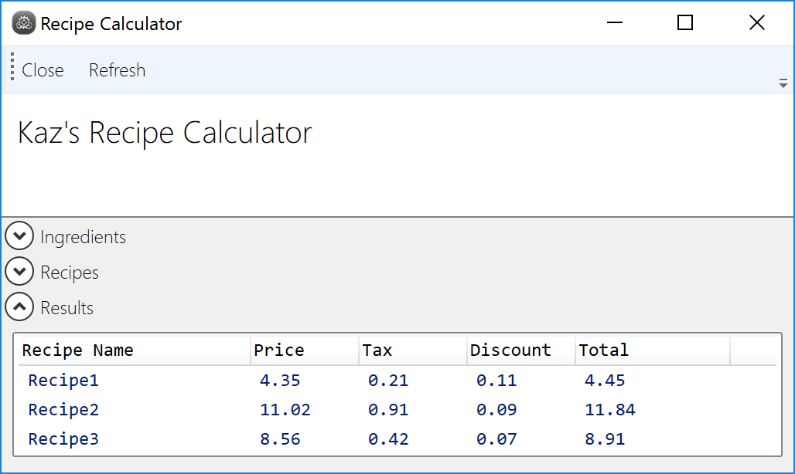

# RecipeCalculator
RecipeCalculator is a coding exercise for a Senior Developer position some where in Los Angeles, and contains three projects:
<ul>
 <li>RecipeCalculator.Model - acts as the business logic + data layer</li>
 <li>RecipeCalculator.UI - a WPF UI project for displaying the results of the Recipe Calculator</li>
 <li>RecipeCalculator.Tests - unit testing project containing a few tests for the RecipeCalculator in the Model </li>
</ul> 
Enjoy!!!

